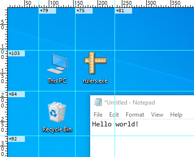

# Rulers - On-Screen Measurement Tool for Windows

A lightweight on-screen ruler application that provides precise pixel measurements and alignment guides for designers, developers, and anyone who needs accurate screen measurements.



## Features

- 📏 **Draggable Guides**: Create horizontal and vertical measurement guides by dragging from the rulers
- 📊 **Coordinate Display Modes**: Show absolute or relative pixel offset
- ⌨️ **Keyboard Shortcuts**: Hold `Ctrl` to make guides interactive
- 💾 **Persistent Settings**: Automatically saves and restores guide positions between runs
- ⚙️ **System Tray Integration**: Minimal interface with tray icon for easy access
- 🖥️ **Multi-Monitor Support**: Automatically detects and creates rulers for all connected monitors and adapts when monitors are added/removed
- 🔋 **Low resource usage**: Minimal CPU load when idle, does not drain your laptop battery. Small on-disk and RAM footprint

## Installation

### Pre-built binary

1. Download from [the releases page](https://github.com/omgtehlion/rulers/releases)

2. Unzip to a folder of your choice

3. Double-click `rulers.exe`

### Building from Source

1. Get [Zig version 0.14](https://ziglang.org/download/#release-0.14.0) and install it.

2. Clone the repository:
```bash
git clone https://github.com/omgtehlion/rulers.git
cd rulers
```

3. Build the project:
```bash
zig build -Doptimize=ReleaseSmall
```

4. Run the application:
```bash
zig-out\bin\rulers.exe
```

## Usage

### Basic Operation

1. **Launch the application** - Rulers will appear on all monitors
2. **Create guides** - Click and drag from the ruler edges to create measurement guides
3. **Move guides** - Hold Ctrl and drag guides to reposition them
4. **Remove guides** - Drag guides back to the ruler edge or use the tray menu

### Tray Menu Options

Right-click the tray icon or any ruler to access context menu:
- **No position** - Do not display pixel coordinates
- **Absolute position** - Display exact pixel coordinates on guides
- **Relative position** - Show distance measurements between guides
- **Clear guides** - Remove all active guides
- **Exit** - Close the application

### Keyboard Shortcuts

- **Ctrl** - Hold to make guides interactive and show semi-transparent overlay
- **Right-click on ruler** - While holding Ctrl, removes all guides

## Configuration

The application automatically saves guide positions to `rulers.ini` in the application directory. The file format is:

```ini
H0=100    # Horizontal guide at Y position 100
V0=250    # Vertical guide at X position 250
```

## License

This project is distributed under a BSD-like license.

## History

Originally created in 2007 as a Delphi7 application. The Zig rewrite modernizes the codebase while maintaining full compatibility with the original functionality and adding new features like 64-bit version, multi-monitor support, and improved menus.
